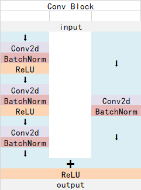
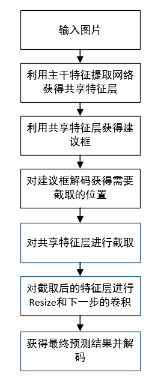

# 什么是FasterRCNN目标检测算法 TWO-Stage 有proposal


> 两者的主要区别在于two-stage算法需要先生成proposal(一个有可能包含待检物体的预选框)，然后进行细粒度的物体检测。而one-stage算法会直接在网络中提取特征来预测物体分类和位置。two-stage算法速度相对较慢但是准确率高，one-stage算法准确率没有two-stage算法高但是速度较快。

> 初步简单获取


> 精细调整


> 特征提取后的共享特征层大小为 38,38,1024
>
> 每个像素有9个框
>
> 先进行一个3x3Conv变为两个通道,在分别进行两个1x1Conv,变换为18,36通道. **18=9x2,代表是否有物体(1个代表为背景概率,另一个代表为物体概率); 36=9x4,代表调整框的参数**
>
> 获得建议框Proposal,和共享特征层都传入ROIPooling,ROIPooling会根据建议框对共享特征层进行截取(会将局部特征层调整为相同的),分别进行框的预测和分类预测


> Faster-RCNN是一个非常有效的目标检测算法，虽然是一个比较早的论文， 但它至今仍是许多目标检测算法的基础。
>
> Faster-RCNN作为一种two-stage的算法，与one-stage的算法相比，two-stage的算法更加复杂且速度较慢，但是检测精度会更高。
>
> 事实上也确实是这样，Faster-RCNN的检测效果非常不错，但是检测速度与训练速度有待提高。

# 源码下载

https://github.com/bubbliiiing/faster-rcnn-pytorch
 喜欢的可以点个star噢。

# Faster-RCNN实现思路

## 一、预测部分

### 1、主干网络介绍

Faster-RCNN可以采用多种的主干特征提取网络，常用的有VGG，Resnet，Xception等等，本文以Resnet网络为例子来给大家演示一下。

Faster-Rcnn对输入进来的图片尺寸没有固定，但是一般会把输入进来的图片短边固定成600，如输入一张1200x1800的图片，会把图片不失真的resize到600x900上。

ResNet50有两个基本的块，**分别名为Conv Block和Identity Block，其中Conv Block输入和输出的维度是不一样的，所以不能连续串联，它的作用是改变网络的维度；Identity Block输入维度和输出维度相同，可以串联，用于加深网络的。**

Conv Block的结构如下：



Identity Block的结构如下：


这两个都是残差网络结构。

Faster-RCNN的主干特征提取网络部分只包含了长宽压缩了四次的内容，第五次压缩后的内容在ROI中使用。即Faster-RCNN在主干特征提取网络所用的网络层如图所示。

以输入的图片为600x600为例，shape变化如下：


最后一层的输出就是公用特征层。

在代码里里面，我们使用resnet50()函数来获得resnet50的公用特征层。

其中features部分为公用特征层，classifier部分为第二阶段用到的分类器。

> nets/resnet50.py

```python
import math

import torch
import torch.nn as nn
from torch.hub import load_state_dict_from_url

#-------------------------------------------------------------------------#
#   主干: 卷积+bn+relu -> 卷积+bn+relu -> 卷积+bn
#   短接: 卷积+bn
#   短接后有relu
#-------------------------------------------------------------------------#
class Bottleneck(nn.Module):
    expansion = 4
    def __init__(self, inplanes, planes, stride=1, downsample=None):
        super().__init__()
        self.conv1 = nn.Conv2d(inplanes, planes, kernel_size=1, stride=stride, bias=False)
        self.bn1 = nn.BatchNorm2d(planes)

        self.conv2 = nn.Conv2d(planes, planes, kernel_size=3, stride=1, padding=1, bias=False)
        self.bn2 = nn.BatchNorm2d(planes)

        self.conv3 = nn.Conv2d(planes, planes * 4, kernel_size=1, bias=False)
        self.bn3 = nn.BatchNorm2d(planes * 4)

        # relu是共用的
        self.relu = nn.ReLU(inplace=True)
        self.downsample = downsample
        self.stride = stride

    def forward(self, x):
        residual = x

        out = self.conv1(x)
        out = self.bn1(out)
        out = self.relu(out)

        out = self.conv2(out)
        out = self.bn2(out)
        out = self.relu(out)

        out = self.conv3(out)
        out = self.bn3(out)
        if self.downsample is not None:
            residual = self.downsample(x)

        out += residual
        out = self.relu(out)

        return out

class ResNet(nn.Module):
    def __init__(self, block, layers, num_classes=1000):
        #-----------------------------------#
        #   假设输入进来的图片是600,600,3
        #-----------------------------------#
        self.inplanes = 64
        super().__init__()

        # 600,600,3 -> 300,300,64
        self.conv1 = nn.Conv2d(3, 64, kernel_size=7, stride=2, padding=3, bias=False)
        self.bn1 = nn.BatchNorm2d(64)
        self.relu = nn.ReLU(inplace=True)

        # 300,300,64 -> 150,150,64
        self.maxpool = nn.MaxPool2d(kernel_size=3, stride=2, padding=0, ceil_mode=True)

        # 150,150,64 -> 150,150,256
        self.layer1 = self._make_layer(block, 64, layers[0])
        # 150,150,256 -> 75,75,512
        self.layer2 = self._make_layer(block, 128, layers[1], stride=2)
        # 75,75,512 -> 38,38,1024  到这里可以获得一个38,38,1024的共享特征层
        self.layer3 = self._make_layer(block, 256, layers[2], stride=2)
        # 38,38,1024 -> 19,19,2048  self.layer4被用在classifier模型中
        self.layer4 = self._make_layer(block, 512, layers[3], stride=2)

        self.avgpool = nn.AvgPool2d(7)  # nn.AdaptiveAvgPool2d((1, 1)) 这样更好,7是专门为224设计的 224/32=7
        self.fc = nn.Linear(512 * block.expansion, num_classes)

        for m in self.modules():
            if isinstance(m, nn.Conv2d):
                n = m.kernel_size[0] * m.kernel_size[1] * m.out_channels
                m.weight.data.normal_(0, math.sqrt(2. / n))
            elif isinstance(m, nn.BatchNorm2d):
                m.weight.data.fill_(1)
                m.bias.data.zero_()

    def _make_layer(self, block, planes, blocks, stride=1):
        downsample = None
        #-------------------------------------------------------------------#
        #   步长不为1或者进出通道不相等就设置下采样层 conv+bn 没有relu
        #-------------------------------------------------------------------#
        if stride != 1 or self.inplanes != planes * block.expansion:
            downsample = nn.Sequential(
                nn.Conv2d(self.inplanes, planes * block.expansion,kernel_size=1, stride=stride, bias=False),
                nn.BatchNorm2d(planes * block.expansion),
            )
        layers = []
        # 第一次有短接层
        layers.append(block(self.inplanes, planes, stride, downsample))
        self.inplanes = planes * block.expansion
        # 后面没有短接层
        for i in range(1, blocks):
            layers.append(block(self.inplanes, planes))
        return nn.Sequential(*layers)

    def forward(self, x):
        x = self.conv1(x)       # 600,600,3   -> 300,300,64
        x = self.bn1(x)
        x = self.relu(x)
        x = self.maxpool(x)     # 300,300,64  -> 150,150,64

        x = self.layer1(x)      # 150,150,64  -> 150,150,256
        x = self.layer2(x)      # 150,150,256 -> 75, 75, 512
        x = self.layer3(x)      # 75, 75, 512 -> 38, 38,1024  到这里可以获得一个38,38,1024的共享特征层
        x = self.layer4(x)      # 38, 38,1024 -> 19, 19,2048

        x = self.avgpool(x)
        x = x.view(x.size(0), -1)
        x = self.fc(x)
        return x

def resnet50(pretrained = False):
    model = ResNet(Bottleneck, [3, 4, 6, 3])
    if pretrained:
        state_dict = load_state_dict_from_url("https://download.pytorch.org/models/resnet50-19c8e357.pth", model_dir="./model_data")
        model.load_state_dict(state_dict)
    #----------------------------------------------------------------------------#
    #   获取特征提取部分，从conv1到model.layer3，最终获得一个38,38,1024的特征层
    #----------------------------------------------------------------------------#
    features    = list([model.conv1, model.bn1, model.relu, model.maxpool, model.layer1, model.layer2, model.layer3])
    #----------------------------------------------------------------------------#
    #   获取分类部分，从model.layer4到model.avgpool
    #----------------------------------------------------------------------------#
    classifier  = list([model.layer4, model.avgpool])

    features    = nn.Sequential(*features)
    classifier  = nn.Sequential(*classifier)
    return features, classifier


if __name__ == "__main__":
    model = ResNet(Bottleneck, [3, 4, 6, 3])
    x = torch.rand(1, 3, 600, 600)
    y = model(x)    # torch.Size([1, 2048, 2, 2])
```

### 2、获得Proposal建议框


获得的公用特征层在图像中就是Feature Map，其有两个应用，一个是和ROIPooling结合使用、另一个是进行一次3x3的卷积后，进行一个18通道的1x1卷积，还有一个36通道的1x1卷积。

在Faster-RCNN中，num_priors也就是先验框的数量就是9，所以两个1x1卷积的结果实际上也就是：

**9 x 4的卷积** 用于预测 **公用特征层上** **每一个网格点上 每一个先验框**的变化情况。**（为什么说是变化情况呢，这是因为Faster-RCNN的预测结果需要结合先验框获得预测框，预测结果就是先验框的变化情况。）**

**9 x 2的卷积** 用于预测 **公用特征层上** **每一个网格点上** **每一个预测框**内部是否包含了物体，**序号为1的内容为包含物体的概率**。

当我们输入的图片的shape是600x600x3的时候，公用特征层的shape就是38x38x1024，相当于把输入进来的图像分割成38x38的网格，然后每个网格存在9个先验框，这些先验框有不同的大小，在图像上密密麻麻。

**9 x 4的卷积**的结果会对这些先验框进行调整，获得一个新的框。

**9 x 2的卷积**会判断上述获得的新框是否包含物体。

到这里我们可以获得了一些有用的框，这些框会利用**9 x 2的卷积**判断是否存在物体。

到此位置还只是粗略的一个框的获取，也就是一个**建议框**。然后我们会在建议框里面继续**找东西。**

> nets/rpn.py

```python
#-----------------------------------------#
#   生成先验框,获得建议框,图中左下部分
#-----------------------------------------#
class RegionProposalNetwork(nn.Module):
    def __init__(
        self,
        in_channels     = 512,
        mid_channels    = 512,
        ratios          = [0.5, 1, 2],
        anchor_scales   = [8, 16, 32],
        feat_stride     = 16,
        mode            = "training",
    ):
        super().__init__()
        #-----------------------------------------#
        #   生成基础先验框，shape为[9, 4]
        #-----------------------------------------#
        self.anchor_base    = generate_anchor_base(anchor_scales = anchor_scales, ratios = ratios)
        n_anchor            = self.anchor_base.shape[0]

        #-----------------------------------------#
        #   先进行一个3x3的卷积，可理解为特征整合 左侧第一个卷积
        #-----------------------------------------#
        self.conv1  = nn.Conv2d(in_channels, mid_channels, 3, 1, 1)
        #-----------------------------------------#
        #   分类预测先验框内部是否包含物体       上面输出为18的卷积, 18=9x2,代表是否有物体;
        #-----------------------------------------#
        self.score  = nn.Conv2d(mid_channels, n_anchor * 2, 1)
        #-----------------------------------------#
        #   回归预测对先验框进行调整            下面输出为36的卷积, 36=9x4,代表调整框的参数,
        #-----------------------------------------#
        self.loc    = nn.Conv2d(mid_channels, n_anchor * 4, 1)

        #-----------------------------------------#
        #   特征点间距步长
        #-----------------------------------------#
        self.feat_stride    = feat_stride
        #-----------------------------------------#
        #   用于对建议框解码并进行非极大抑制
        #-----------------------------------------#
        self.proposal_layer = ProposalCreator(mode)

        #--------------------------------------#
        #   对FPN的网络部分进行权值初始化
        #--------------------------------------#
        normal_init(self.conv1, 0, 0.01)
        normal_init(self.score, 0, 0.01)
        normal_init(self.loc, 0, 0.01)

    def forward(self, x, img_size, scale=1.):
        """
        x: base_feature共享特征层
        img_size: 原图大小
        """
        n, _, h, w = x.shape
        #-----------------------------------------#
        #   先进行一个3x3的卷积，可理解为特征整合
        #-----------------------------------------#
        x = F.relu(self.conv1(x))

        #-----------------------------------------#
        #   分类预测先验框内部是否包含物体
        #   通道变化
        #   b, 18, h, w -> b, h, w, 18 -> b, h*w*9, 2    h*w*9代表每一个先验框
        #-----------------------------------------#
        rpn_scores = self.score(x)
        rpn_scores = rpn_scores.permute(0, 2, 3, 1).contiguous().view(n, -1, 2)

        #-----------------------------------------#
        #   获得先验框调整参数
        #   回归预测对先验框进行调整
        #   通道变化
        #   b, 36, h, w -> b, h, w, 36 -> b, h*w*9, 4    h*w*9代表每一个先验框
        #-----------------------------------------#
        rpn_locs = self.loc(x)
        rpn_locs = rpn_locs.permute(0, 2, 3, 1).contiguous().view(n, -1, 4)

        #--------------------------------------------------------------------------------------#
        #   获得先验框得分
        #   进行softmax概率计算，每个先验框只有两个判别结果  softmax变化到0~1之间,和为1
        #   rpn_scores: [b, h*w*9, 2]  [:, :, 1] 取最后一维的最后一个
        #   内部包含物体或者内部不包含物体，rpn_softmax_scores[:, :, 1]的内容为包含物体的概率
        #--------------------------------------------------------------------------------------#
        rpn_softmax_scores  = F.softmax(rpn_scores, dim=-1)
        rpn_fg_scores       = rpn_softmax_scores[:, :, 1].contiguous()
        rpn_fg_scores       = rpn_fg_scores.view(n, -1)     # n指的是n张图片

        #------------------------------------------------------------------------------------------------#
        #   生成先验框，此时获得的anchor是布满网格点的，当输入图片为600,600,3的时候，shape为(12996, 4)
        #------------------------------------------------------------------------------------------------#
        anchor = _enumerate_shifted_anchor(np.array(self.anchor_base), self.feat_stride, h, w)

        # 建议框,建议框索引
        rois        = list()
        roi_indices = list()
        for i in range(n):
            #-----------------------------------------#
            #   用于对建议框解码并进行非极大抑制
            #-----------------------------------------#
            roi         = self.proposal_layer(rpn_locs[i], rpn_fg_scores[i], anchor, img_size, scale = scale)
            batch_index = i * torch.ones((len(roi),))
            rois.append(roi)
            roi_indices.append(batch_index)
        # 列表变为矩阵
        rois        = torch.cat(rois, dim=0)
        roi_indices = torch.cat(roi_indices, dim=0)

        # 先验框调整参数,先验框得分(是否包含物体),建议框,建议框索引,先验框
        return rpn_locs, rpn_scores, rois, roi_indices, anchor
```


### 3、Proposal建议框的解码

通过第二步我们获得了38x38x9个先验框的预测结果。预测结果包含两部分。

**9 x 4的卷积** 用于预测 **公用特征层上** **每一个网格点上 每一个先验框**的变化情况。**

**9 x 2的卷积** 用于预测 **公用特征层上** **每一个网格点上** **每一个预测框**内部是否包含了物体。

相当于就是将整个图像分成38x38个网格；然后从每个网格中心建立9个先验框，一共38x38x9个，12996个先验框。

**当输入图像shape不同时，先验框的数量也会发生改变。**


先验框虽然可以代表一定的**框的位置信息与框的大小信息**，但是其是有限的，无法表示任意情况，因此还需要调整。

**9 x 4中的9表示了这个网格点所包含的先验框数量，其中的4表示了框的中心与长宽的调整情况。**

> nets/rpn.py

```python
#-----------------------------------------#
#   用于对建议框解码并进行非极大抑制
#-----------------------------------------#
class ProposalCreator():
    def __init__(
        self,
        mode,
        nms_iou             = 0.7,
        n_train_pre_nms     = 12000,
        n_train_post_nms    = 600,      # 前600个得分最高的建议框
        n_test_pre_nms      = 3000,
        n_test_post_nms     = 300,      # 前300个得分最高的建议框
        min_size            = 16

    ):
        #-----------------------------------#
        #   设置预测还是训练
        #-----------------------------------#
        self.mode               = mode
        #-----------------------------------#
        #   建议框非极大抑制的iou大小
        #-----------------------------------#
        self.nms_iou            = nms_iou
        #-----------------------------------#
        #   训练用到的建议框数量
        #-----------------------------------#
        self.n_train_pre_nms    = n_train_pre_nms
        self.n_train_post_nms   = n_train_post_nms  # 前600个得分最高的建议框
        #-----------------------------------#
        #   预测用到的建议框数量
        #-----------------------------------#
        self.n_test_pre_nms     = n_test_pre_nms
        self.n_test_post_nms    = n_test_post_nms   # 前300个得分最高的建议框
        self.min_size           = min_size

    def __call__(self, loc, score, anchor, img_size, scale=1.):
        """
        loc:   先验框调整参数
        score: 先验框得分
        anchor:先验框
        return:非极大后的建议框
        """
        if self.mode == "training":
            n_pre_nms   = self.n_train_pre_nms
            n_post_nms  = self.n_train_post_nms
        else:
            n_pre_nms   = self.n_test_pre_nms
            n_post_nms  = self.n_test_post_nms

        #-----------------------------------#
        #   将先验框转换成tensor
        #-----------------------------------#
        anchor = torch.from_numpy(anchor)
        if loc.is_cuda:
            anchor = anchor.cuda()
        #-----------------------------------#
        #   将RPN网络预测结果转化成尚未筛选的建议框
        #-----------------------------------#
        roi = loc2bbox(anchor, loc)
        #-----------------------------------#
        #   防止建议框超出图像边缘
        #-----------------------------------#
        roi[:, [0, 2]] = torch.clamp(roi[:, [0, 2]], min = 0, max = img_size[1])
        roi[:, [1, 3]] = torch.clamp(roi[:, [1, 3]], min = 0, max = img_size[0])

        #-----------------------------------#
        #   建议框的宽高的最小值不可以小于16
        #-----------------------------------#
        min_size    = self.min_size * scale
        keep        = torch.where(((roi[:, 2] - roi[:, 0]) >= min_size) & ((roi[:, 3] - roi[:, 1]) >= min_size))[0]
        #-----------------------------------#
        #   将对应的建议框保留下来
        #-----------------------------------#
        roi         = roi[keep, :]
        score       = score[keep]

        #-----------------------------------#
        #   根据得分进行排序，取出建议框
        #-----------------------------------#
        order       = torch.argsort(score, descending=True)
        if n_pre_nms > 0:
            order   = order[:n_pre_nms]
        roi     = roi[order, :]
        score   = score[order]

        #-----------------------------------#
        #   对建议框进行非极大抑制
        #   使用官方的非极大抑制会快非常多
        #-----------------------------------#
        keep    = nms(roi, score, self.nms_iou)
        keep    = keep[:n_post_nms]     # 筛选出的分最高的前n个框
        roi     = roi[keep]
        return roi
```

### 4、对Proposal建议框加以利用（RoiPoolingConv）


 让我们对建议框有一个整体的理解：
 **事实上建议框就是对图片哪一个区域有物体存在进行初步筛选。**

通过主干特征提取网络，我们可以获得一个公用特征层，当输入图片为600x600x3的时候，它的shape是38x38x1024，然后建议框会对这个公用特征层进行截取。

**其实公用特征层里面的38x38对应着图片里的38x38个区域，38x38中的每一个点相当于这个区域内部所有特征的浓缩。**

建议框会对这38x38个区域进行截取，也就是认为这些区域里存在目标，然后将截取的结果进行resize，resize到14x14x1024的大小。

**然后再对每个建议框再进行Resnet原有的第五次压缩。压缩完后进行一个平均池化，再进行一个Flatten，最后分别进行一个num_classes的全连接和(num_classes)x4全连接。**

**num_classes的全连接用于对最后获得的框进行分类，(num_classes)x4全连接用于对相应的建议框进行调整。**

通过这些操作，我们可以获得所有**建议框的调整情况**，和这个建议框**调整后框内物体的类别。**

事实上，在上一步获得的**建议框就是ROI的先验框**。

> ROIPooling
>
> 将图像分为不同大小,下图分为4份,分别进行最大池化,获得2x2特征图
>
> 这里分为了14x14


对Proposal建议框加以利用的过程与shape变化如图所示：


建议框调整后的结果就是最终的预测结果了，可以在图上进行绘画了。

> nets/classifier.py

```python
"""分类器网络"""
class Resnet50RoIHead(nn.Module):
    def __init__(self, n_class, roi_size, spatial_scale, classifier):
        """
        n_class:    num_class+1  分类数+是否包含物体
        roi_size:   roi后图像宽高 14
        classifier: vgg16/resnet的最后分类部分 resnet的layer4和avgpool
        """
        super().__init__()
        #--------------------------------------#
        #   ROIPooling: 将大小不同的图像转换为相同大小
        #--------------------------------------#
        self.roi = RoIPool((roi_size, roi_size), spatial_scale)
        self.classifier = classifier
        #--------------------------------------#
        #   对ROIPooling后的的结果进行回归预测
        #   [300, 2048] => [300, (num_class+1)*4]
        #--------------------------------------#
        self.cls_loc = nn.Linear(2048, n_class * 4)
        #-----------------------------------#
        #   对ROIPooling后的的结果进行分类
        #   [300, 2048] => [300, num_class+1]
        #-----------------------------------#
        self.score = nn.Linear(2048, n_class)
        #-----------------------------------#
        #   权值初始化
        #-----------------------------------#
        normal_init(self.cls_loc, 0, 0.001)
        normal_init(self.score, 0, 0.01)

    def forward(self, x, rois, roi_indices, img_size):
        """
        x: 共享特征层 [1,1024,38,38]
        rois: 建议框 前300个
        roi_indices: 建议框序号 [300]
        img_size: 
        """

        """图中ROIPooling"""
        n, _, _, _ = x.shape
        if x.is_cuda:
            roi_indices = roi_indices.cuda()
            rois = rois.cuda()

        rois_feature_map = torch.zeros_like(rois)
        rois_feature_map[:, [0,2]] = rois[:, [0,2]] / img_size[1] * x.size()[3]
        rois_feature_map[:, [1,3]] = rois[:, [1,3]] / img_size[0] * x.size()[2]

        indices_and_rois = torch.cat([roi_indices[:, None], rois_feature_map], dim=1)
        #-----------------------------------#
        #   利用建议框对公用特征层进行截取
        #   pool: [300,1024,14,14] 300个建议框,1024是通道数,14是roi将图像分为14x14块
        #   300个调整后的局部特征层
        #-----------------------------------#
        pool = self.roi(x, indices_and_rois)

        """图中右下角分类部分"""
        #--------------------------------------------------------------#
        #   利用classifier网络进行特征提取 classifier包含layer4和avgpool
        #   输出: [300, 2048, 1, 1]
        fc7 = self.classifier(pool)
        #   当输入为一张图片的时候，这里获得的f7的shape为[300, 2048]
        #--------------------------------------------------------------#
        fc7 = fc7.view(fc7.size(0), -1)

        #--------------------------------------#
        #   对ROIPooling后的的结果进行回归预测
        #   [300, 2048] => [300, (num_class+1)*4]
        #--------------------------------------#
        roi_cls_locs    = self.cls_loc(fc7)

        #-----------------------------------#
        #   对ROIPooling后的的结果进行分类
        #   [300, 2048] => [300, num_class+1]
        #-----------------------------------#
        roi_scores      = self.score(fc7)
        # [300, 9*4] => [b, 300, (num_class+1)*4]   前面300假设只有一张图片
        roi_cls_locs    = roi_cls_locs.view(n, -1, roi_cls_locs.size(1))
        # [300, 9]   => [b, 300, num_class+1]       前面300假设只有一张图片
        roi_scores      = roi_scores.view(n, -1, roi_scores.size(1))

        # 建议框的调整参数,建议框的种类得分
        return roi_cls_locs, roi_scores
```

### 5、在原图上进行绘制

在第四步的结尾，我们对建议框进行再一次进行解码后，我们可以获得预测框在原图上的位置，而且这些预测框都是经过筛选的。这些筛选后的框可以直接绘制在图片上，就可以获得结果了。

### 6、整体的执行流程



几个小tip：

1. **共包含了两次解码过程。**
2. **先进行粗略的筛选再细调。**
3. **第一次获得的建议框解码后的结果是对共享特征层featuremap进行截取。**

## 二、训练部分

Faster-RCNN的训练过程和它的预测过程一样，分为两部分，首先要训练**获得建议框网络，然后再训练后面利用ROI获得预测结果的网络。**

### 1、建议框网络的训练

公用特征层如果要获得**建议框的预测结果，需要再进行一次3x3的卷积后，进行一个2通道的1x1卷积，还有一个36通道的1x1卷积。**

在Faster-RCNN中，num_priors也就是先验框的数量就是9，所以两个1x1卷积的结果实际上也就是：

**9 x 4的卷积** 用于预测 **公用特征层上** **每一个网格点上 每一个先验框**的变化情况。**（为什么说是变化情况呢，这是因为Faster-RCNN的预测结果需要结合先验框获得预测框，预测结果就是先验框的变化情况。）**

**9 x 2的卷积** 用于预测 **公用特征层上** **每一个网格点上** **每一个预测框**内部是否包含了物体。

也就是说，**我们直接利用Faster-RCNN建议框网络预测到的结果，并不是建议框在图片上的真实位置，需要解码才能得到真实位置。**

而在训练的时候，**我们需要计算loss函数，这个loss函数是相对于Faster-RCNN建议框网络的预测结果的**。我们需要把图片输入**到当前的Faster-RCNN建议框的网络中，得到建议框的结果；同时还需要进行编码**，这个编码是把**真实框的位置信息格式转化为Faster-RCNN建议框预测结果的格式信息**。

也就是，我们需要找到 **每一张用于训练的图片**的**每一个真实框对应的先验框**，并求出**如果想要得到这样一个真实框，我们的建议框预测结果应该是怎么样的。**

**从建议框预测结果获得真实框的过程被称作解码，而从真实框获得建议框预测结果的过程就是编码的过程。**

因此我们只需要将**解码过程逆过来就是编码过程了。**

> nets/frcnn_training.py

```python
def bbox_iou(bbox_a, bbox_b):
    if bbox_a.shape[1] != 4 or bbox_b.shape[1] != 4:
        print(bbox_a, bbox_b)
        raise IndexError
    tl = np.maximum(bbox_a[:, None, :2], bbox_b[:, :2])
    br = np.minimum(bbox_a[:, None, 2:], bbox_b[:, 2:])
    area_i = np.prod(br - tl, axis=2) * (tl < br).all(axis=2)
    area_a = np.prod(bbox_a[:, 2:] - bbox_a[:, :2], axis=1)
    area_b = np.prod(bbox_b[:, 2:] - bbox_b[:, :2], axis=1)
    return area_i / (area_a[:, None] + area_b - area_i)

def bbox2loc(src_bbox, dst_bbox):
    width = src_bbox[:, 2] - src_bbox[:, 0]
    height = src_bbox[:, 3] - src_bbox[:, 1]
    ctr_x = src_bbox[:, 0] + 0.5 * width
    ctr_y = src_bbox[:, 1] + 0.5 * height

    base_width = dst_bbox[:, 2] - dst_bbox[:, 0]
    base_height = dst_bbox[:, 3] - dst_bbox[:, 1]
    base_ctr_x = dst_bbox[:, 0] + 0.5 * base_width
    base_ctr_y = dst_bbox[:, 1] + 0.5 * base_height

    eps = np.finfo(height.dtype).eps
    width = np.maximum(width, eps)
    height = np.maximum(height, eps)

    dx = (base_ctr_x - ctr_x) / width
    dy = (base_ctr_y - ctr_y) / height
    dw = np.log(base_width / width)
    dh = np.log(base_height / height)

    loc = np.vstack((dx, dy, dw, dh)).transpose()
    return loc

class AnchorTargetCreator(object):
    def __init__(self, n_sample=256, pos_iou_thresh=0.7, neg_iou_thresh=0.3, pos_ratio=0.5):
        self.n_sample       = n_sample
        self.pos_iou_thresh = pos_iou_thresh
        self.neg_iou_thresh = neg_iou_thresh
        self.pos_ratio      = pos_ratio

    def __call__(self, bbox, anchor):
        argmax_ious, label = self._create_label(anchor, bbox)
        if (label > 0).any():
            loc = bbox2loc(anchor, bbox[argmax_ious])
            return loc, label
        else:
            return np.zeros_like(anchor), label

    def _calc_ious(self, anchor, bbox):
        #----------------------------------------------#
        #   anchor和bbox的iou
        #   获得的ious的shape为[num_anchors, num_gt]
        #----------------------------------------------#
        ious = bbox_iou(anchor, bbox)

        if len(bbox)==0:
            return np.zeros(len(anchor), np.int32), np.zeros(len(anchor)), np.zeros(len(bbox))
        #---------------------------------------------------------#
        #   获得每一个先验框最对应的真实框  [num_anchors, ]
        #---------------------------------------------------------#
        argmax_ious = ious.argmax(axis=1)
        #---------------------------------------------------------#
        #   找出每一个先验框最对应的真实框的iou  [num_anchors, ]
        #---------------------------------------------------------#
        max_ious = np.max(ious, axis=1)
        #---------------------------------------------------------#
        #   获得每一个真实框最对应的先验框  [num_gt, ]
        #---------------------------------------------------------#
        gt_argmax_ious = ious.argmax(axis=0)
        #---------------------------------------------------------#
        #   保证每一个真实框都存在对应的先验框
        #---------------------------------------------------------#
        for i in range(len(gt_argmax_ious)):
            argmax_ious[gt_argmax_ious[i]] = i

        return argmax_ious, max_ious, gt_argmax_ious

    def _create_label(self, anchor, bbox):
        # ------------------------------------------ #
        #   1是正样本，0是负样本，-1忽略
        #   初始化的时候全部设置为-1
        # ------------------------------------------ #
        label = np.empty((len(anchor),), dtype=np.int32)
        label.fill(-1)

        # ------------------------------------------------------------------------ #
        #   argmax_ious为每个先验框对应的最大的真实框的序号         [num_anchors, ]
        #   max_ious为每个真实框对应的最大的真实框的iou             [num_anchors, ]
        #   gt_argmax_ious为每一个真实框对应的最大的先验框的序号    [num_gt, ]
        # ------------------------------------------------------------------------ #
        argmax_ious, max_ious, gt_argmax_ious = self._calc_ious(anchor, bbox)

        # ----------------------------------------------------- #
        #   如果小于门限值则设置为负样本
        #   如果大于门限值则设置为正样本
        #   每个真实框至少对应一个先验框
        # ----------------------------------------------------- #
        label[max_ious < self.neg_iou_thresh] = 0
        label[max_ious >= self.pos_iou_thresh] = 1
        if len(gt_argmax_ious)>0:
            label[gt_argmax_ious] = 1

        # ----------------------------------------------------- #
        #   判断正样本数量是否大于128，如果大于则限制在128
        # ----------------------------------------------------- #
        n_pos = int(self.pos_ratio * self.n_sample)
        pos_index = np.where(label == 1)[0]
        if len(pos_index) > n_pos:
            disable_index = np.random.choice(pos_index, size=(len(pos_index) - n_pos), replace=False)
            label[disable_index] = -1

        # ----------------------------------------------------- #
        #   平衡正负样本，保持总数量为256
        # ----------------------------------------------------- #
        n_neg = self.n_sample - np.sum(label == 1)
        neg_index = np.where(label == 0)[0]
        if len(neg_index) > n_neg:
            disable_index = np.random.choice(neg_index, size=(len(neg_index) - n_neg), replace=False)
            label[disable_index] = -1

        return argmax_ious, label
```

**focal会忽略一些重合度相对较高但是不是非常高的先验框，一般将重合度在0.3-0.7之间的先验框进行忽略。**

### 2、Roi网络的训练

通过上一步已经可以对建议框网络进行训练了，建议框网络会提供一些位置的建议，在ROI网络部分，其会将建议框根据进行一定的截取，并获得对应的预测结果，**事实上就是将上一步建议框当作了ROI网络的先验框。**

因此，我们需要计算所有**建议框和真实框的重合程度**，并**进行筛选**，如果某个真实框和建议框的重合程度**大于0.5则认为该建议框为正样本，如果重合程度小于0.5则认为该建议框为负样本**

因此我们可以对真实框进行编码，这个编码是相对于建议框的，也就是，当我们存在这些建议框的时候，我们的ROI预测网络需要有什么样的预测结果才能将这些建议框调整成真实框。

每次训练我们都放入128个建议框进行训练，同时要注意正负样本的平衡。

> nets/frcnn_training.py

```python
class ProposalTargetCreator(object):
    def __init__(self, n_sample=128, pos_ratio=0.5, pos_iou_thresh=0.5, neg_iou_thresh_high=0.5, neg_iou_thresh_low=0):
        self.n_sample = n_sample
        self.pos_ratio = pos_ratio
        self.pos_roi_per_image = np.round(self.n_sample * self.pos_ratio)
        self.pos_iou_thresh = pos_iou_thresh
        self.neg_iou_thresh_high = neg_iou_thresh_high
        self.neg_iou_thresh_low = neg_iou_thresh_low

    def __call__(self, roi, bbox, label, loc_normalize_std=(0.1, 0.1, 0.2, 0.2)):
        roi = np.concatenate((roi.detach().cpu().numpy(), bbox), axis=0)
        # ----------------------------------------------------- #
        #   计算建议框和真实框的重合程度
        # ----------------------------------------------------- #
        iou = bbox_iou(roi, bbox)

        if len(bbox)==0:
            gt_assignment = np.zeros(len(roi), np.int32)
            max_iou = np.zeros(len(roi))
            gt_roi_label = np.zeros(len(roi))
        else:
            #---------------------------------------------------------#
            #   获得每一个建议框最对应的真实框  [num_roi, ]
            #---------------------------------------------------------#
            gt_assignment = iou.argmax(axis=1)
            #---------------------------------------------------------#
            #   获得每一个建议框最对应的真实框的iou  [num_roi, ]
            #---------------------------------------------------------#
            max_iou = iou.max(axis=1)
            #---------------------------------------------------------#
            #   真实框的标签要+1因为有背景的存在
            #---------------------------------------------------------#
            gt_roi_label = label[gt_assignment] + 1

        #----------------------------------------------------------------#
        #   满足建议框和真实框重合程度大于neg_iou_thresh_high的作为负样本
        #   将正样本的数量限制在self.pos_roi_per_image以内
        #----------------------------------------------------------------#
        pos_index = np.where(max_iou >= self.pos_iou_thresh)[0]
        pos_roi_per_this_image = int(min(self.pos_roi_per_image, pos_index.size))
        if pos_index.size > 0:
            pos_index = np.random.choice(pos_index, size=pos_roi_per_this_image, replace=False)

        #-----------------------------------------------------------------------------------------------------#
        #   满足建议框和真实框重合程度小于neg_iou_thresh_high大于neg_iou_thresh_low作为负样本
        #   将正样本的数量和负样本的数量的总和固定成self.n_sample
        #-----------------------------------------------------------------------------------------------------#
        neg_index = np.where((max_iou < self.neg_iou_thresh_high) & (max_iou >= self.neg_iou_thresh_low))[0]
        neg_roi_per_this_image = self.n_sample - pos_roi_per_this_image
        neg_roi_per_this_image = int(min(neg_roi_per_this_image, neg_index.size))
        if neg_index.size > 0:
            neg_index = np.random.choice(neg_index, size=neg_roi_per_this_image, replace=False)

        #---------------------------------------------------------#
        #   sample_roi      [n_sample, ]
        #   gt_roi_loc      [n_sample, 4]
        #   gt_roi_label    [n_sample, ]
        #---------------------------------------------------------#
        keep_index = np.append(pos_index, neg_index)

        sample_roi = roi[keep_index]
        if len(bbox)==0:
            return sample_roi, np.zeros_like(sample_roi), gt_roi_label[keep_index]

        gt_roi_loc = bbox2loc(sample_roi, bbox[gt_assignment[keep_index]])
        gt_roi_loc = (gt_roi_loc / np.array(loc_normalize_std, np.float32))

        gt_roi_label = gt_roi_label[keep_index]
        gt_roi_label[pos_roi_per_this_image:] = 0
        return sample_roi, gt_roi_loc, gt_roi_label
```


# 三 正负样本

> 正样本
>
> ​	预测框和真实框的IoU最大的那一个(防止没有超过0.7的)
>
> ​	预测框和真实框的IoU > 0.7
>
> 负样本
>
> ​	预测框和真实框的IoU < 0.3
>
> 其余样本丢弃掉


# FasterRCNN Loss

> 预测结果解码调整先验框得到预测框
>
>  	中心调整: 先验框坐标 + 预测结果 * 先验框宽高 = 最终坐标
>			
>    	宽高调整: 先验框宽高 * e^预测结果 = 最终宽高
>
>  
>
> 真实框求相对于预测值的值(用来求loss)
>
>    	中心参数 = (真实坐标 - 先验框坐标) / 原始宽高
>			
>    	宽高参数 = ln(真实宽高 / 先验框宽高)
>
>    求出来的参数和预测结果进行loss计算
>
> 
>
> 原始坐标和宽高指的是先验框的坐标和宽高 
